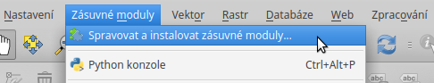
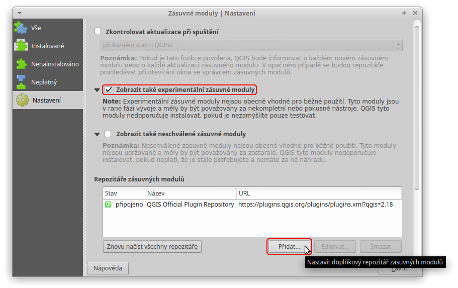
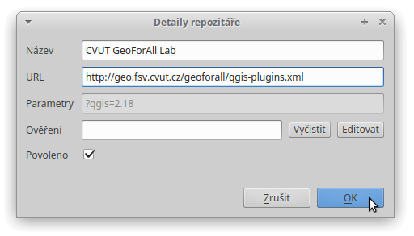
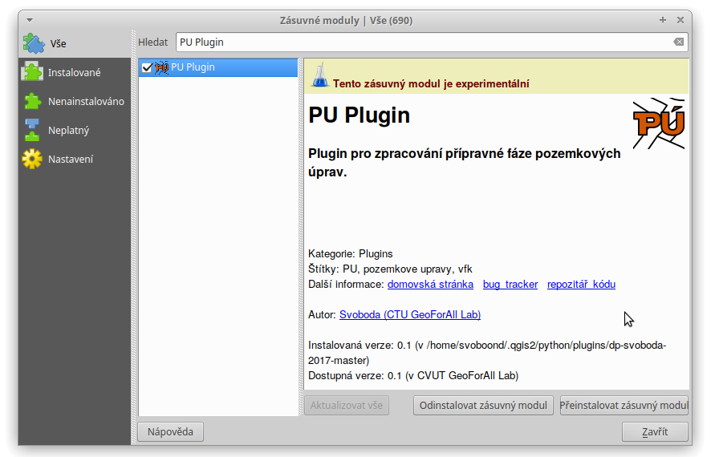
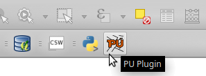

Instalace
*********

Zásuvný modul není součástí oficiálního repositáře QGIS, přesto ho lze nainstalovat
stejným způsobem jako jiné pluginy. Stačí do programu QGIS přidat repositář
organizace *GeoForAll Lab*.

Nejprve je tedy otevřete okno :guilabel:`Zásuvné moduly` :menuselection:`-->` :guilabel:`Spravovat a instalovat zásuvné moduly`:

   Otevření okna *Zásuvné moduly*.

V záložce :guilabel:`Nastavení` aktivujte volbu :guilabel:`Zobrazit také experimentální zásuvné moduly`.

Pomocí tlačítka :guilabel:`Přidat` doplňte repositář organizace *GeoForAll Lab*:

::

   Název:	CVUT GeoForAll Lab
   URL:		http://geo.fsv.cvut.cz/geoforall/qgis-plugins.xml

   Přidání repositáře.

   Přidání repositáře *GeoForAll Lab*.

V záložce :guilabel:`Vše` nebo :guilabel:`Nenainstalované` vyhledejte ``PU Plugin``. Vyberte zásuvný modul a klikněte na :guilabel:`Instalovat zásuvný modul`.

   Instalace zásuvného modulu.

Po úspešném nainstalování se v :guilabel:`Panelu nástrojů zásuvného modulu` objeví jeho ikona.

   Ikona zásuvného modulu v panelu nástrojů.

Nyní je zásuvný modul připraven k použití.